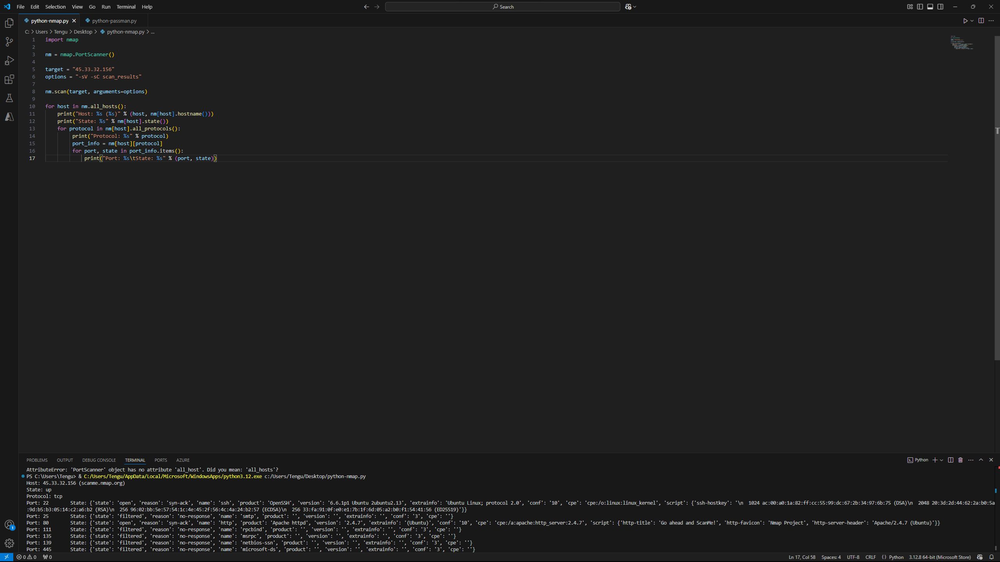
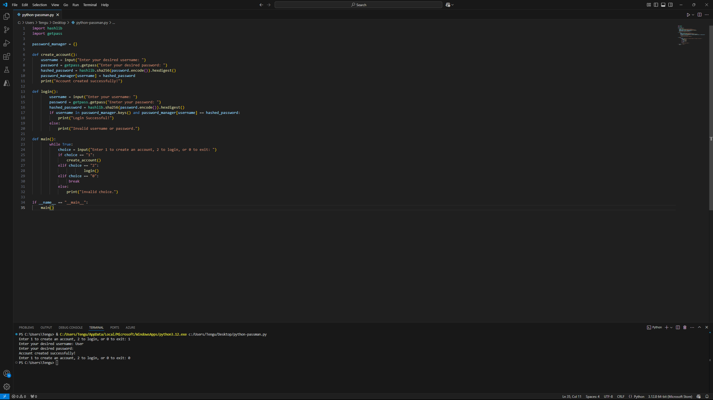
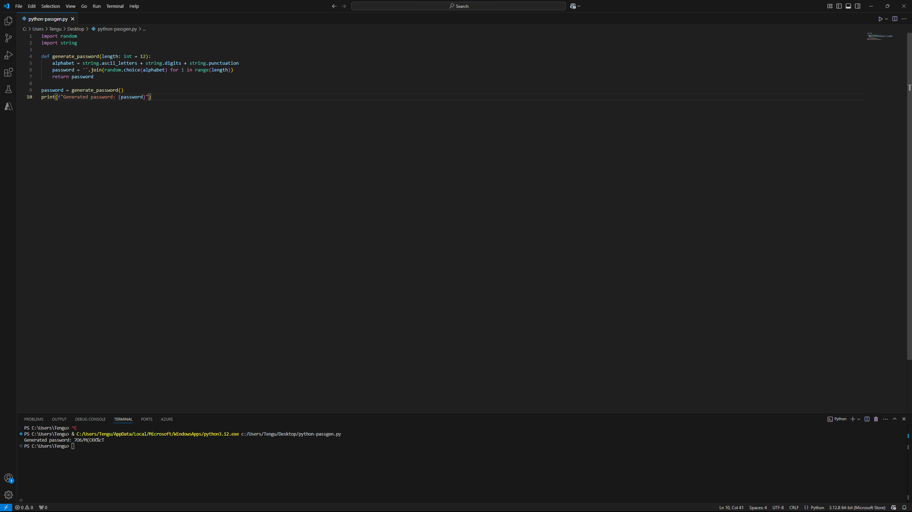

# SIEM Video


In the video above I demonstrate a project that I had setup for a home SIEM lab that was created in Azure. I utilized Sentinel, created a honeypot, created a ubuntu server which host a MISP server to connect IOC data to sentinel, and created a workbook with failed RDP attempts coming from specific countries on a world map. This project was created with no knowledge to begin with and helped me increase my knowledge of how SOC analyst will use queries and such to draft incident management reports and how the systems notify us when something does happen on the network. I am eager to learn more and expand my knowledge as I know there are other SIEM programs that are utilized in other networks. I still have much to learn and am hoping in the future this project will demonstrate this fact. Thank you for taking the time to either read or watch my video. 

# Python Scripts
These images contain code I was working in VStudio that allow us to do a couple of things. First image has nmap module that allows us to enter an ip and gather information about systems we want to analyze for open port vulnerabilities using Nmap. Second image is a script that allows us to create a user and password, and last is a password generation tool to make secure passwords. These projects are just a few of the ones that I plan on completing in my free time as I want to learn more about scripting within python as it is a versatile language that I see a lot in the cyber field. I have also included the py scripts for the password gen and manager in my repository for further evaluation.

  

### Donut

